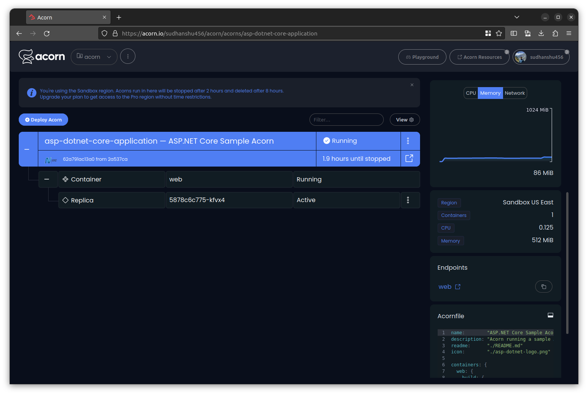

# Deploying ASP.NET Core Application on Acorn

Nowadays, each business needs to have an online presence. We keep exploring innovative ways to connect with customers, reaching them in the most accessible way. One such avenue is through online platforms, for example, for services like pizza ordering. The convenience of a few clicks leading to a delicious pizza at your doorstep is great to have! This is where a framework like ASP.NET Core comes into play. ASP.NET Core, a robust and versatile framework from Microsoft, is ideal for building dynamic web applications like a pizza ordering system. It offers flexibility, high performance, and ease of use, making it a favored choice for developers.

However, the journey from development to deployment can often be complex and intimidating. This is where Acron, a streamlined cloud platform, becomes a game-changer. Acron simplifies the entire process, allowing you to focus on what matters most - your application. It enables you to package your ASP.NET Core application, along with all its dependencies, into a single file known as an Acornfile. This encapsulation means deploying your pizza ordering application becomes as easy as a single click, freeing you from the hassle of intricate deployment setups.

[Acorn Cloud Platform](https://beta.acorn.io/) lets you run your acorns in free [sandbox environment](https://docs.acorn.io/sandbox), which you can use for testing purpose if need. You can also share nifty artifact with a link, making it a breeze for you to deploy with a single click into your very own sandbox environment. You can run your Acorns as often as you like for upto 2hrs to evaluate and experiment your application. If you wish to [run your Production workloads](https://docs.acorn.io/aws/overview), upgrade to a teams and enterprise plan to deploy and manage applications in your AWS account.

If you are looking to get started on the Acorn Platform and give the ASP.Net Core application a whirl, just hit that link below and have a peek!

[](https://acorn.io/run/ghcr.io/infracloudio/asp-dotnet-core-acorn:v%23.%23.%23-%23?ref=sudhanshu456)

To learn how to write your own Acornfile for deploying an ASP.NET Core application or to further customize it, follow along with this tutorial. We will be examining a sample pizza ordering application built using ASP.NET Core.

> _Note: Everything shown in this tutorial can be found in [this repository](https://github.com/infracloudio/asp-dotnet-core-acorn)._

## Pre-requisites

- [Acorn CLI](https://docs.acorn.io/installation/installing)
- GitHub account to sign up for the Acorn Platform.

## Acorn Login

Login to the [Acorn Platform](http://beta.acorn.io) using the GitHub Sign-In option with your GitHub user.


After the installation of Acorn CLI for your OS, you can login to the Acorn platform.

```sh
acorn login beta.acorn.io
```

## Deploy your ASP.NET Core application

We will be deploying a sample web application to order pizzas. You can select your favourite pizza of the desired size, add toppings and place an order for it. [Blazing Pizza Store App](https://github.com/dotnet-presentations/blazor-workshop/) is part of the Blazor Workshop conducted in .NET Conf 2019. You can find the source code for the Acorn of this sample application [here](https://github.com/infracloudio/asp-dotnet-core-acorn).

There are two ways you can try this sample application.

- Using Acorn platform dashboard.
- Using CLI

The first way is the easiest one where, in just a few clicks you can deploy the ASP.Net Core application to the platform and start using it. However, if you want to customize the application or want to understand how you can run your own ASP.Net Core applications using Acorn, use the second option.

## Running ASP.NET Core application using Dashboard

We can run our application from an existing image from the Acorn Cloud Platform UI by clicking on the _”Deploy Acorns”_ button.

Choose the source for deploying your Acorns


On the “Deploy an Acorn” page, provide a name such as `asp-dotnet-sample-app` and type in the below Pre-built Acorn image and choose Create.

> Note: If you have your own custom Acorn image, you can also provide that.

```sh
ghcr.io/infracloudio/asp-dotnet-core-acorn:v#.#.#-#
```


Now, the sample application has been provisioned on the Acorn Platform and is available for Two hours. You can choose to upgrade to an enterprise account to keep it running longer.


Once the Acorn status comes to `Running`, you can open up the ASP.NET application on the given endpoint link, showing below three vertical dots, right after running status.

## Running the ASP.NET Core application using acorn CLI

Running your own customized ASP.NET Core application through the CLI method is a great way to understand Acornfile. Additionally, you can customize the application according to your requirements, or apply your Acorn knowledge to operate your own ASP.NET Core application.

To run the ASP.NET Core app using CLI, let’s start by cloning its source repository.

```sh
git clone https://github.com/infracloudio/asp-dotnet-core-acorn.git
```

Here’s the folder structure overview for the sample app.

```sh
.
├── Acornfile
├── asp-dotnet-logo.png
├── Dockerfile
├── img
├── LICENSE
├── README.md
├── src
├── THIRD-PARTY-NOTICES.md
└── tutorial.md

2 directories, 7 files
```

### Acornfile

This is where all the Acorn configuration lives. The Acornfile describes the containers, arguments, secrets and volumes to deploy the application. During the Acorn build all of the Docker containers will be built or pulled from a registry and packaged into the Acorn image.

```bash

name:        "ASP.NET Core Sample Acorn"
description: "Acorn running a sample ASP.NET Core app"
readme:      "./README.md"
icon:        "./asp-dotnet-logo.png"

containers: {
  web: {
    build: {
      context: "./src"
      dockerfile: "./Dockerfile"
    }
    env: {
      "ASPNETCORE_ENVIRONMENT": "Development"
    }
    ports: publish: "80/http"
  }
}
```

Here’s a quick description of the Acornfile above. For a full overview of the Acornfile specification please see Acorn [documentation](https://docs.acorn.io/authoring/overview).

- `containers`: section describes the set of containers your Acorn app consists of.
- `web` - Our ASP.NET Core App container.
- `build`: build from source using the given context.
- `env`: environment variables, referencing a secret or referencing an Acorn argument
- `ports`: using the publish type, we expose the app outside the cluster using an auto-generated ingress resource

### Deploy your Application

We will now deploy our application to the Acorn Platform. The following command will build and run the Acorn on the hosted platform in a single step. Since we’ve already logged in to the platform in the previous step, this command will talk to the platform to build and deploy your application. For production deployments you will want to build the image and push it to a registry.

From the same folder as your Acornfile, run :

```sh
acorn run -n asp-dotnet-core-application
```

Once the application is running successfully, it will output a URL for the application endpoint.


## Using the application

Once you follow one of the above methods of deploying the ASP.NET Core application, you’ll get a endpoint in the Acorn dashboard or in the CLI output, that will help you reach to your application in browser.

For this sample deployment the endpoint url is `https://asp-dotnet-core-application-32566025.ccx3c8.on-acorn.io/`


ideal
## Acorn Dashboard

The Acorn Dashboard is integrated with multiple features such as Events, Logs, Details and accessing the Shell of the Application. Details include the CPU, Memory, Network, and Errors for the Application.



> Explore various available options by clicking the Menu option on your Acorn App and to access the Acorn Dashboard head to [Acorn.io](https://www.acorn.io/) and login with your credentials.

## Development Mode

In development mode, Acorn will watch the local directory for changes and synchronize them to the running Acorn app. In general, changes to the Acornfile are directly synchronized, e.g. adding environment variables, etc. Depending on the change, the deployed containers will be recreated.

If you've defined a line `if args.dev { dirs: "/app": "./" }` in the Acornfile, it will enable hot-reloading of code by mounting the defined local directory into the app container, though all things are put watch so if you change the anything in acornfile that also triggers the synchronization.

You will see the change applied when you reload the application's page in your browser.

## How to Build and Push an artifact to a registry

Once you're done with the changes, and application is working as expected, you can proceed to build and packaging to a registry, later the acorn image can be used directly in the Acorn platform using the dashboard, as described earlier in running the application using Dashboard.

To understand how this works, let assume you want to push it to GCR(GitHub Container Registry).

### Log in to the registry

Before building and you need to login to the desired container registry you wish to push. In below example we're logging into GitHub Container Registry.

```sh
acorn login ghcr.io
```

### Build and push the image

After, login you can build, tag and push the image using the below command.

```sh
acorn build -t ghcr.io/infracloudio/asp-dot-net-core-acorn:v0.0.0.1 --push
```

## What's Next?

1. Any app provisioned under Acorn sandbox region is available for only 2hrs, in order to keep it running longer you need to upgrade to Pro account.
2. After deploying you can edit the Acorn Application or remove it if no longer needed. Click the Edit option to edit your Acorn's Image. Toggle the Advanced Options switch for additional edit options.
3. Remove the Acorn by selecting the Remove option from your Acorn dashboard.

## Conclusion

In this tutorial, we've learned how to effortlessly deploy an ASP.NET Core application on the Acorn Platform. Acorn simplifies the process, enabling quick deployment, sandbox testing, and convenient management through its user-friendly dashboard. Customization options empower developers, making Acorn an good choice for ASP.NET Core applications.